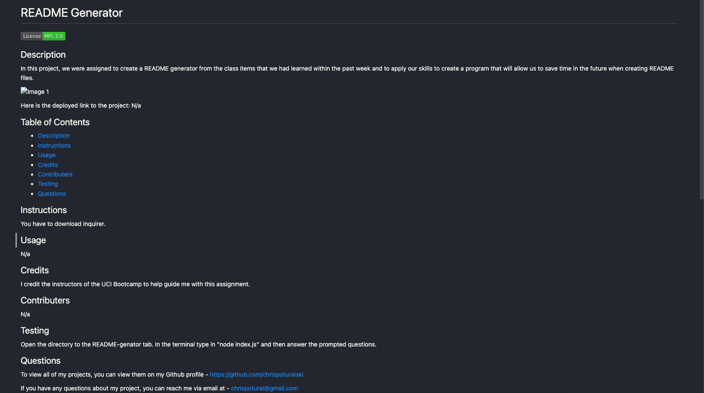

# Project-09 Node README-file generator

## Description

Working with node

Here is the deployed link to the project: N/a

## Table of Contents

- [Description](#description)
- [Instructions](#instructions)
- [Usage](#usage)
- [Credits](#credits)
- [Contributers](#contributers)
- [Testing](#testing)
- [Questions](#questions)

## Instructions

run a function to download inquirer

## Usage

N/a

## Credits

UCI Bootcamp professors

## Contributers

N/a

## Testing 

Open integrated terminal, and type node index.js, then answer following questions

## Questions

To view all of my projects, you can view them on my Github profile -  https://github.com/chrispoturalski

If you have any questions about my project, you can reach me via email at - chrispotural@gmail.com

